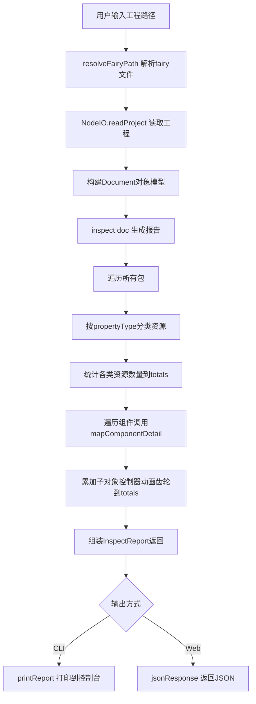

# Inspect 命令逻辑分析

> 本文档详细分析 OpenFairyGUI 项目中 `inspect` 命令的实现逻辑、数据流和核心代码。

## 一、概述

`inspect` 是 OpenFairyGUI 提供的项目内容报告命令。它读取一个 FairyGUI 工程（`.fairy` 文件或工程目录），**不修改文档**，而是返回一份结构化的项目内容统计报告（`InspectReport`），用于快速了解工程内包含的包、资源、组件、控制器、动画、齿轮等数量与明细。

与 `publish` / `restore` / `atlas` 等 transform 不同，`inspect()` 是一个**只读分析函数**，它不是 `Transform`（不会传给 `doc.transform()`），而是直接接收 `Document` 并返回报告对象。

### 类比理解

可以把 `inspect` 想象成一个"项目体检仪"：你把工程送进来，它不动手术刀，只做体检，最后给你出一张体检单——上面列着有多少个包、每个包里多少图片/声音/字体/组件、每个组件下挂了多少子对象、控制器、动画，以及齿轮总数。

## 二、命令入口

`inspect` 提供两个入口：CLI 命令行 和 Web HTTP API。两者最终都调用同一个核心函数 `inspect(doc)`。

### 2.1 CLI 入口

文件：`packages/cli/src/cli.ts`

```
ofgui inspect <project-dir>
```

CLI 流程（`cmdInspect` 函数，`cli.ts:300`）：

1. 校验参数，缺少时打印用法 `Usage: ofgui inspect <project-dir>` 并退出。
2. `resolveFairyPath(args[0])`：把输入解析为 `.fairy` 文件路径。可传入目录（自动查找唯一 `.fairy`）或直接传 `.fairy` 文件。
3. `new NodeIO()` 创建 Node 环境的 I/O 适配器。
4. `io.readProject(fairyPath)` 读取工程，构建 `Document` 对象模型。
5. `inspect(doc)` 生成 `InspectReport`。
6. `printReport(report)` 把报告格式化输出到控制台。

控制台输出格式（`printReport`，`cli.ts:316`）：

```
Project: <fairyPath>

ID: <projectId>
Type: <projectType>, Version: <version>

Packages: <n>
  Images:       <n>
  Sounds:       <n>
  Fonts:        <n>
  MovieClips:   <n>
  Components:   <n>
  DisplayObjs:  <n>
  Gears:        <n>
  Controllers:  <n>
  Transitions:  <n>

Package details:
  <pkgName> (<pkgId>):  img, <snd> snd, <font> font, <comp> comp
```

### 2.2 Web API 入口

文件：`packages/web/src/api/inspect.ts`

```
POST /api/inspect
请求体: { inputPath: string }
响应:   { report: InspectReport }
```

`handleInspect` 函数（`inspect.ts:25`）流程：

1. `parseBody` 解析请求体，校验 `inputPath` 必填。
2. `resolveFairyPath` / `createNodeIO`（来自 `./shared.js`）解析路径并创建 I/O。
3. `io.readProject(fairyPath)` 读取工程。
4. `inspectFn(doc)` 生成报告。
5. `jsonResponse(res, 200, { report })` 返回 JSON。
6. 任何异常返回 500 并附带错误消息。

> 注：Web 版的 `inspect` 是**同步**返回的（立即给出结果），与 `publish` 的异步任务模式不同——因为 `inspect` 是纯内存计算，耗时短。

## 三、核心数据结构

文件：`packages/functions/src/inspect.ts`

### 3.1 InspectCategoryReport（单类资源汇总）

```ts
export interface InspectCategoryReport {
  count: number;
  details: Array<{ name: string; id: string; path?: string; exported?: boolean }>;
}
```

每个资源类别（图片/声音/字体/动画片段/组件）都用此结构：
- `count`：该类资源数量
- `details`：明细列表，每项含 `name`、`id`、`path`（资源在包内的路径，默认 `/`）、`exported`（是否导出）

### 3.2 InspectReport（完整报告）

```ts
export interface InspectReport {
  projectId: string;
  projectType: number;
  version: string;
  packages: Array<{
    name: string;
    id: string;
    publishName: string;
    resources: {
      images: InspectCategoryReport;
      sounds: InspectCategoryReport;
      fonts: InspectCategoryReport;
      movieClips: InspectCategoryReport;
      components: InspectCategoryReport;
    };
    componentDetails: Array<{
      name: string;
      id: string;
      childCount: number;
      controllerCount: number;
      transitionCount: number;
    }>;
  }>;
  totals: {
    packages: number;
    images: number;
    sounds: number;
    fonts: number;
    movieClips: number;
    components: number;
    displayObjects: number;
    gears: number;
    controllers: number;
    transitions: number;
  };
}
```

报告分三层：
- **顶层**：项目 ID、类型、版本
- **packages**：每个包的资源分类汇总 + 组件明细
- **totals**：全项目合计（10 项统计指标）

## 四、核心实现逻辑

文件：`packages/functions/src/inspect.ts:99`

`inspect(doc)` 函数主体：

```ts
export function inspect(doc: Document): InspectReport {
  const root = doc.getRoot();
  const totals = { packages: 0, images: 0, sounds: 0, fonts: 0,
    movieClips: 0, components: 0, displayObjects: 0,
    gears: 0, controllers: 0, transitions: 0 };

  const packages = root.listPackages().map((pkg) => {
    totals.packages++;
    const resources = pkg.listResources();

    const images = resources.filter((r) => r.propertyType === 'ImageResource');
    const sounds = resources.filter((r) => r.propertyType === 'SoundResource');
    const fonts = resources.filter((r) => r.propertyType === 'FontResource');
    const movieClips = resources.filter((r) => r.propertyType === 'MovieClipResource');
    const components = pkg.listComponents();

    // 累加各类资源到 totals
    totals.images += images.length;
    // ... 其余类别同理

    const componentDetails = components.map((component) => mapComponentDetail(component, totals));

    return { name, id, publishName, resources: {...}, componentDetails };
  });

  return { projectId, projectType, version, packages, totals };
}
```

### 4.1 资源分类逻辑

`inspect` 通过 `resource.propertyType` 字段做**类型过滤**，把 `pkg.listResources()` 返回的统一资源列表分成 5 类：

| propertyType 值      | 分类       |
|---------------------|-----------|
| `ImageResource`     | 图片       |
| `SoundResource`     | 声音       |
| `FontResource`      | 字体       |
| `MovieClipResource` | 动画片段    |
| `Component`         | 组件（单独通过 `listComponents()` 获取）|

注意：组件数量通过 `pkg.listComponents()` 单独获取（而非从 `listResources()` 过滤），但组件同时也会出现在 `listResources()` 中。`resources.components` 的 details 也是用 `mapResource` 映射的，所以组件明细在 `resources.components.details` 和 `componentDetails` 两处都有体现，区别是 `componentDetails` 多了子对象/控制器/动画的计数。

### 4.2 辅助函数

#### mapResource（`inspect.ts:54`）

把资源对象映射为报告明细项：

```ts
function mapResource(resource: PackageResource): InspectCategoryReport['details'][number] {
  return {
    name: resource.getName(),
    id: resource.getId(),
    path: resource.getPath?.() ?? '/',
    exported: resource.getExported?.() ?? false,
  };
}
```

用可选链 `?.()` 兼容资源对象上可能不存在的方法（防御式编程，针对不同资源类型可能未实现某接口的情况）。

#### mapComponentDetail（`inspect.ts:63`）

把组件映射为组件明细，**同时累加全局 totals**：

```ts
function mapComponentDetail(component, totals) {
  const children = component.listChildren();
  const controllers = component.listControllers();
  const transitions = component.listTransitions();

  totals.displayObjects += children.length;
  totals.controllers += controllers.length;
  totals.transitions += transitions.length;

  // 遍历每个子对象，累加其齿轮数到 totals.gears
  for (const child of children) {
    totals.gears += child.listGears().length;
  }

  return { name, id, childCount, controllerCount, transitionCount };
}
```

关键点：`totals` 对象在 `map` 回调中被**闭包共享并就地修改**，因此遍历包/组件的过程中，`displayObjects` / `controllers` / `transitions` / `gears` 四项指标被持续累加。这是一个"边映射边统计"的模式——返回结构的同时产生副作用更新 totals。

### 4.3 publishName 的回退

每个包的报告里有 `publishName: pkg.getPublishName() || pkg.getName()`——如果包未设置发布名，则用包名本身作为 publishName，与 publish 流程的命名规则保持一致。

## 五、数据流图



## 六、资源类型识别机制

`inspect` 依赖 `resource.propertyType` 字符串做类型分发。这是 OpenFairyGUI core 包为每种资源定义的固定标识：

| 类型字符串             | 对应资源            |
|----------------------|-------------------|
| `ImageResource`      | 图片资源            |
| `SoundResource`      | 声音资源            |
| `FontResource`       | 字体资源            |
| `MovieClipResource`  | 动画片段资源        |
| `Component`          | 组件资源            |
| `MiscResource`       | 杂项资源（inspect 未统计）|
| `SpineResource`      | Spine 骨骼（未统计）|
| `DragonBonesResource`| 龙骨骨骼（未统计）  |

注意：`inspect` 当前只统计 5 类（图片/声音/字体/动画/组件），**未统计 Misc / Spine / DragonBones**。如果工程包含这些资源，它们不会出现在报告的 resources 分类中，但它们若被组件引用，仍可能计入包的总体资源数。这是 inspect 当前的一个覆盖范围限制。

## 七、与 publish 的关系

`inspect` 和 `publish` 共享同一套 `Document` / `Package` / `Resource` 对象模型，但职责截然不同：

| 维度     | inspect                          | publish                              |
|---------|----------------------------------|--------------------------------------|
| 性质     | 只读分析函数，返回报告             | Transform，修改并写出文件             |
| 输入     | `Document`                        | `PublishOptions`（含 output/fs 等）  |
| 输出     | `InspectReport` 对象              | 磁盘上的 .fui 二进制 + 图集 PNG + 代码 |
| 是否改文档 | 否                               | 是（写入 extras、创建 sprite 节点等）   |
| 耗时     | 纯内存遍历，毫秒级                  | 涉及图集打包/序列化/文件 IO，秒级以上  |

典型用法：先 `inspect` 查看工程内容，确认无误后再 `publish` 发布。

## 八、关键源码索引

| 关注点                 | 文件路径                                    | 行号    |
|----------------------|-------------------------------------------|--------|
| CLI 命令分发           | `packages/cli/src/cli.ts`                 | 102    |
| CLI inspect 处理      | `packages/cli/src/cli.ts`                 | 300    |
| 控制台报告打印         | `packages/cli/src/cli.ts`                 | 316    |
| 路径解析（找 .fairy）  | `packages/cli/src/cli.ts`                 | 61     |
| Web API 处理器         | `packages/web/src/api/inspect.ts`         | 25     |
| 核心 inspect 函数      | `packages/functions/src/inspect.ts`        | 99     |
| 报告类型定义           | `packages/functions/src/inspect.ts`        | 14     |
| 资源映射 mapResource   | `packages/functions/src/inspect.ts`        | 54     |
| 组件映射 mapComponentDetail | `packages/functions/src/inspect.ts`    | 63     |
| 对外导出               | `packages/functions/src/index.ts`         | 1      |

## 九、扩展建议

若需增强 `inspect`，可考虑：

1. **补充资源类型覆盖**：在 `resources` 中增加 `misc` / `spine` / `dragonBones` 分类，使报告更完整。
2. **依赖关系统计**：利用 `pkg.listDependencies()` 输出包间依赖图。
3. **分支信息**：当工程使用分支时，按分支统计资源数量。
4. **体积统计**：遍历资源文件大小，给出包的总体积估算（需配合 `basePath` 和文件读取）。
5. **JSON 导出**：CLI 增加 `--json` 选项直接输出 `InspectReport` 的 JSON，便于脚本消费。

---

## 引用说明

本文档基于以下源码分析整理：
- `packages/cli/src/cli.ts` — CLI 入口与 `cmdInspect` 实现
- `packages/web/src/api/inspect.ts` — Web API `handleInspect` 实现
- `packages/functions/src/inspect.ts` — 核心 `inspect` 函数与 `InspectReport` 类型
- `packages/functions/src/index.ts` — 对外导出
- `packages/core` — `Document` / `Package` / `Resource` 对象模型与 `NodeIO`
