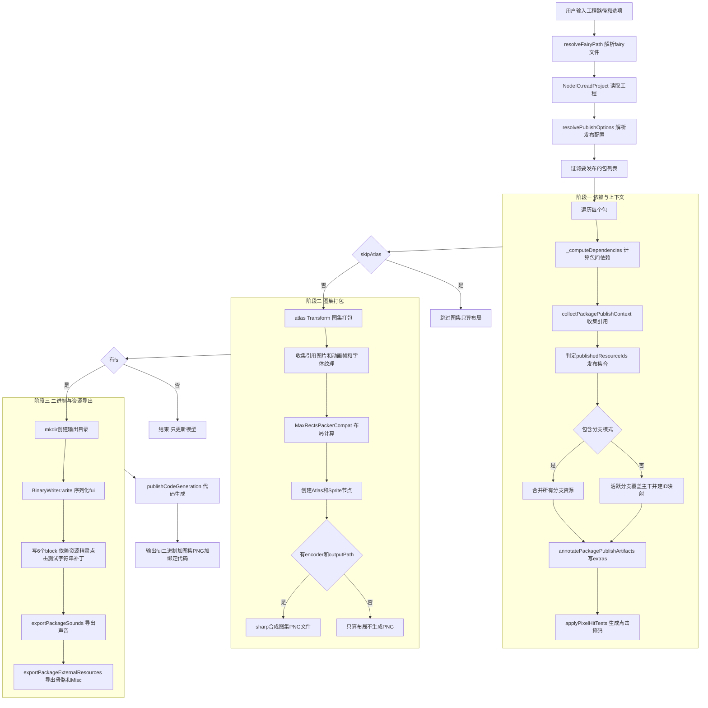

# Publish 命令逻辑分析

> 本文档详细分析 OpenFairyGUI 项目中 `publish` 命令的实现逻辑、数据流和核心代码。

## 一、概述

`publish` 是 OpenFairyGUI 的核心发布命令，它把一个 FairyGUI 工程（`.fairy` 文件）转换成运行时可加载的产物：**.fui 二进制包** + **图集 PNG** + **生成代码**。它是一个 `Transform`，通过 `doc.transform(publish(options))` 调用，会就地修改 `Document` 模型（写入发布元数据、创建 Sprite/Atlas 节点）并写出文件到磁盘。

`publish` 编排了 5 个主要阶段：
1. 选项解析与包过滤
2. 依赖计算与发布上下文收集（引用分析、像素点击测试、分支合并）
3. 图集打包（MaxRects 布局 + sharp 合成 PNG）
4. 二进制序列化（每个包写出一个 .fui / .bytes 文件）
5. 声音/外部资源导出 + 代码生成

### 类比理解

把 `publish` 想象成一条"出版流水线"：
- **选项解析** = 接订单（要印什么格式、印几本、要不要压缩）
- **引用分析** = 编辑审稿（哪些资源真正被引用了，哪些可以剔除，分支版本怎么合并）
- **图集打包** = 排版拼版（把零散图片用 MaxRects 算法拼成大图，省显存）
- **二进制序列化** = 制版印刷（按 FairyGUI 二进制协议把内容写成 .fui）
- **代码生成** = 附赠说明书（生成 Unity C# 或 TypeScript 绑定代码）

## 二、命令入口

`publish` 提供两个入口：CLI 命令行 和 Web HTTP API。两者都调用 `@openfairygui/functions` 的 `publish()` Transform。

### 2.1 CLI 入口

文件：`packages/cli/src/cli.ts`

```
ofgui publish <project-dir> --output <dir> [options]
```

Publish 选项（`cli.ts:35`）：

| 选项                 | 说明                                           |
|---------------------|------------------------------------------------|
| `--output, -o`      | 输出目录（必填）                                 |
| `--compressed`      | 压缩二进制数据（覆盖工程设置）                    |
| `--packages a,b,c`  | 只发布指定包（逗号分隔）                          |
| `--branch <name>`   | 活跃分支名（用于"主干合并活跃分支"模式）           |
| `--project-type`    | 覆盖项目类型（unity/layabox/cocoscreator 等）     |
| `--max-atlas-size`  | 覆盖图集最大尺寸（默认 2048）                     |
| `--no-atlas`        | 跳过图集打包（只输出 .fui 二进制）               |

CLI 流程（`cmdPublish` 函数，`cli.ts:456`）：

1. `parseArgs` 解析参数，校验 `positionals[0]` 和 `--output` 必填。
2. `resolveFairyPath` 解析 `.fairy` 路径，`projectDir = path.dirname(fairyPath)`。
3. `new NodeIO()` + `io.readProject(fairyPath)` 读取工程构建 `Document`。
4. `parseProjectType` 把字符串项目类型转成数字 ID，若提供则 `doc.getRoot().setProjectType(...)`。
5. `resolvePublishOptions(doc, overrides)` 解析发布默认值（见 §3.1）。
6. 构造 `atlasConfig`（含 `readFileRaw` 适配器读取源图）。
7. 尝试 `import('sharp')` 作为 `encoder`（图集合成需要），不可用时只算布局不生成 PNG。
8. 构造 `publishFs`（Node 文件系统适配器：`readFileRaw`/`writeFileRaw`/`mkdir`/`readdir`/`deleteFile`/`join`）。
9. `await doc.transform(publish({...}))` 执行发布 Transform。
10. 打印完成信息。

### 2.2 Web API 入口

文件：`packages/web/src/api/publish.ts`

```
POST /api/publish
请求体: { inputPath, outputPath, compressed?, noAtlas?, packages?, branch?, projectType?, maxAtlasSize? }
响应:   { taskId }
```

`handlePublish` 函数（`publish.ts:44`）流程——**异步任务模式**（与 inspect 的同步模式不同）：

1. 解析请求体，校验 `inputPath` / `outputPath` 必填。
2. `generateId()` 生成 `taskId`，`createSSELogger(taskId)` 创建 SSE 日志通道。
3. **立即** `jsonResponse(res, 200, { taskId })` 返回任务 ID（不阻塞）。
4. 后台异步执行发布（IIFE）：
   - 临时劫持 `console.warn` / `console.error` 重定向到 SSE logger，前端可实时看日志。
   - 复用 CLI 同样的流程：`resolveFairyPath` → `createNodeIO().readProject` → `resolvePublishOptions` → 构造 atlasConfig / encoder / `createPublishFs()` → `doc.transform(publish(...))`。
   - 成功 `completeTask(taskId, true)`，失败 `completeTask(taskId, false)`。
   - `finally` 恢复原始 `console`。

> 设计要点：publish 耗时较长（图集打包 + 文件 IO），所以 Web 版用"先返回 taskId + SSE 推送日志"的异步模式，避免 HTTP 长连接超时。

## 三、选项解析：resolvePublishOptions

文件：`packages/functions/src/publish.ts:243`

`resolvePublishOptions(doc, overrides)` 从工程设置（`project.xml` 里的 `<publish>` 节点）读取默认值，并与命令行覆盖项合并，返回最终生效的配置 `ResolvedPublishOptions`。

### 3.1 解析逻辑

```ts
export function resolvePublishOptions(doc, overrides = {}): ResolvedPublishOptions {
  const root = doc.getRoot();
  const settings = (root.getSettings?.() ?? {}) as RootProjectSettings;
  const publishSettings: CliPublishSettings = settings.publish ?? {};
  const atlasSetting = publishSettings.atlasSetting ?? {};
  const projectType = root.getProjectType();

  // 文件扩展名：覆盖项 > 项目类型默认 > 工程配置 > 'fui'
  const fileExtension = overrides.fileExtension
    ?? resolveDefaultPublishFileExtension(projectType, publishSettings);

  // 压缩开关
  let compressed = overrides.compressed ?? publishSettings.compressDesc ?? false;
  if (projectType === ProjectType.Unity) {
    compressed = overrides.compressed ?? false;  // Unity 默认不压缩
  }

  // 图集选项合并（覆盖项 > 工程设置 > 默认值）
  const atlasOptions = {
    maxSize: overrides.atlas?.maxSize ?? atlasSetting.maxSize ?? 2048,
    fast: overrides.atlas?.fast ?? atlasSetting.fast ?? true,
    allowRotation: overrides.atlas?.allowRotation ?? atlasSetting.allowRotation ?? false,
    padding: overrides.atlas?.padding ?? atlasSetting.padding ?? 2,
    powerOfTwo: overrides.atlas?.powerOfTwo ?? atlasSetting.sizeOption === 'pot',
    square: overrides.atlas?.square ?? atlasSetting.forceSquare ?? false,
    multiPage: overrides.atlas?.multiPage ?? atlasSetting.paging ?? true,
    trimImage: overrides.atlas?.trimImage ?? atlasSetting.trimImage ?? false,
    extractAlpha: overrides.atlas?.extractAlpha ?? atlasSetting.extractAlpha ?? false,
  };

  return { compressed, fileExtension, packages: overrides.packages, atlas: atlasOptions };
}
```

### 3.2 文件扩展名规则

`resolveDefaultPublishFileExtension`（`publish.ts:204`）：

| 项目类型        | 默认扩展名 | 说明                          |
|----------------|-----------|-------------------------------|
| Unity          | `bytes`   | Unity 用 `_fui.bytes`         |
| CocosCreator   | `bin` 或工程配置 | Cocos 默认 bin               |
| 其他           | `fui` 或工程配置 | 通用二进制契约                |

### 3.3 发布文件名规则

`resolvePublishFileName`（`publish.ts:230`）：

- `bytes` 扩展 → `{publishName}_fui.bytes`（Unity 约定）
- 其他扩展 → `{publishName}.{ext}`（如 `Main.fui`）

### 3.4 图集运行时选项

`resolvePublishAtlasRuntimeOptions`（`publish.ts:223`）根据扩展名决定两个内部行为：

```ts
{
  preserveInputOrderOnTie: fileExtension === 'fui',  // fui 保持输入顺序做平局打破
  directSingleImageOutput: fileExtension === 'bytes', // bytes 允许单图直接输出
}
```

- `directSingleImageOutput`：当包内只有一张未裁剪的图片时，跳过 MaxRects 打包，直接把原图当 atlas0 输出（匹配 Unity CLI 参考行为）。
- `preserveInputOrderOnTie`：MaxRects 打分相同时按输入顺序排（匹配编辑器/fui 行为）。

## 四、publish Transform 主体

文件：`packages/functions/src/publish.ts:946`

`publish(options)` 返回一个 `Transform`，主体流程：

```ts
export function publish(options: PublishOptions): Transform {
  return createTransform('publish', async (doc: Document): Promise<void> => {
    const root = doc.getRoot();
    const logger = doc.getLogger();
    const resolved = resolvePublishOptions(doc, { ... });

    // Step 1: 确定要发布的包列表
    let allPackages = root.listPackages();
    if (resolved.packages?.length > 0) {
      const names = new Set(resolved.packages);
      allPackages = allPackages.filter((p) => names.has(p.getName()));
    }

    // 分支处理模式
    const branchProcessing = publishSettings.branchProcessing ?? 0;
    const includeBranches = branchProcessing === 0;  // 0 = 包含所有分支
    const activeBranch = includeBranches ? '' : (options.branch ?? '');

    // Step 1.5: 每个包计算依赖 + 注解发布产物
    for (const pkg of allPackages) {
      _computeDependencies(pkg, pkgMap);
      await annotatePackagePublishArtifacts(pkg, options.basePath, encoder, {
        includeBranches, activeBranch,
      });
    }

    // Step 2: 图集打包
    if (!options.skipAtlas) {
      await atlas(atlasOpts)(doc);
    }

    // Step 3: 写 .fui 二进制 + 导出声音/外部资源
    if (!options.fs) return;  // 无 fs 只算布局不写文件
    await options.fs.mkdir(options.output);
    for (const pkg of allPackages) {
      const bw = new BinaryWriter(writerFs);
      await bw.write(doc, filePath, { compressed, packageIndex: pkgIndex });
      await exportPackageSounds(...);
      await exportPackageExternalResources(...);
    }

    // Step 4: 代码生成
    await publishCodeGeneration(doc, { basePath, fs, packages: allPackages });
  });
}
```

## 五、阶段详解

### 5.1 阶段一：依赖计算 _computeDependencies

文件：`publish.ts:1075`

扫描包内所有组件的子对象 `font` 属性，如果 `font="ui://xxxxxxxx..."`（bitmap 字体跨包引用），则把目标包 ID 加入依赖列表。

```ts
function _computeDependencies(pkg: Package, pkgMap: Map<string, Package>): void {
  const referencedPkgIds = new Set<string>();
  // 扫描所有组件子对象的 font URL
  for (const res of pkg.listResources()) {
    if (res.propertyType !== 'Component') continue;
    for (const child of res.listChildren?.() ?? []) {
      scanFontUrl((child as HasOptionalFont).getFont?.());
    }
  }
  // 清空旧依赖，按 ID 排序后重新添加
  for (const dep of pkg.listDependencies()) pkg.removeDependency(dep);
  for (const refId of [...referencedPkgIds].sort()) {
    pkg.addDependency(pkgMap.get(refId));
  }
}
```

> 注：编辑器只为 bitmap 字体的跨包 URL 生成依赖。这是发布时确定包加载顺序的关键。

### 5.2 阶段二：发布上下文收集 collectPackagePublishContext

文件：`publish.ts:489`

这是 publish 最复杂的部分——决定**哪些资源会被写入二进制**。核心思路：遍历所有组件，收集被引用的资源 ID（`referencedIds`），再结合"导出标记"和"图集 sprite 引用"确定最终发布集合 `publishedResourceIds`。

#### 5.2.1 引用收集

遍历每个组件（Component），收集其子对象（children）上所有 `ui://{pkgId}...` 形式的引用：

- `getSrc()` — 图片/组件源引用
- `getFont()` — 字体引用（支持数组）
- `getText()` — 文本内嵌的 ui:// 引用（用正则扫描）
- `getUrl()` / `getDefaultItem()` / `getIcon()` / `getSelectedIcon()` / `getDropdown()` / `getSound()` / `getInstanceIcon()` / `getInstanceSelectedIcon()` / `getVtScrollBarRes()` / `getHzScrollBarRes()` / `getHeaderRes()` / `getFooterRes()` — 各种资源 URL
- `getInstanceComboItems()` — 下拉项图标
- `getListItems()` — 列表项 icon/url
- `listGears()` 的 `getValues()` / `getDefaultValue()` — 齿轮引用
- 组件级 `getHitTest()` — 像素点击测试目标
- `listTransitions()` 的 `getStartValue()` / `getEndValue()` — 动画关键帧引用
- 字体资源的 `getTextureId()` — bitmap 字体纹理
- 骨骼资源的 `getRequireIds()` — 依赖传递（迭代到不动点）

辅助函数：
- `addLocalUiResourceRef`：解析单个 `ui://{pkgId}{id}` 提取 id
- `addLocalUiResourceRefsFromText`：扫描文本中所有 `ui://` 引用
- `addLocalUiResourceRefsFromUnknown`：递归处理数组/字符串

#### 5.2.2 发布集合判定

对每类资源应用不同规则（`publish.ts:588`）：

| 资源类型         | 发布条件                                              |
|-----------------|------------------------------------------------------|
| Component       | `getExported()` 或 `referencedIds` 包含              |
| Image           | 导出 / 被引用 / 是图集 sprite / 是像素点击测试目标      |
| MovieClip/Sound | 导出 / 被引用                                         |
| Misc/Skeleton   | 导出 / 被引用                                         |
| Font            | 导出 / 被引用                                         |
| 其他            | 导出 / 被引用                                         |

骨骼资源（Spine/DragonBones）有**依赖传递**：若骨骼被发布，其 `getRequireIds()` 指向的依赖资源也要发布，循环到不再变化（`publish.ts:624` 的 `while changed` 循环）。

#### 5.2.3 分支合并

当 `includeBranches === false`（即 `branchProcessing !== 0`，"主干合并活跃分支"模式）时（`publish.ts:638`）：

- 按 `propertyType|path|name` 构建资源键
- 主干资源 vs 活跃分支资源分别建索引
- 活跃分支资源覆盖主干同名资源：`effectiveResourceIds` 记录"分支 ID → 主干 ID"映射
- 主干资源若被活跃分支覆盖，则用分支资源 ID 替代发布
- 最终 `publishedResourceIds` = 合并后的集合，`effectiveResourceIds` = ID 映射表

`effectiveResourceIds` 的作用：分支资源的二进制 ID 用主干 ID 写入（让运行时按主干 ID 索引到分支内容），通过 `setPublishedIdExtra` 写入 `_publishedId` extras。

#### 5.2.4 注解 annotatePackagePublishArtifacts

`publish.ts:779`：把收集结果写入模型：

1. 对每个资源 `setPublishedIdExtra(resource, effectiveId)` — 写 `_publishedId` extras
2. `applyPixelHitTests` — 对像素点击测试图片生成位图掩码
3. 写包级 extras：`publishedResourceIds`（排序后的数组）、`publishedIncludeBranches`、`publishedEffectiveResourceIds`
4. 对 Misc 资源设 `_publishedFile`（`.atlas` → `.atlas.txt`），骨骼资源设 `_publishedFile`（`.skel` → `.skel.bytes`）

### 5.3 像素点击测试 applyPixelHitTests

文件：`publish.ts:716`

对 `pixelHitTestImageIds` 中的图片生成**1/2 降采样的 alpha 位掩码**，存入 `image.setPixelHitTestData()`：

1. 用 encoder(sharp) 读取原图 metadata
2. `resize` 到 `width/2 × height/2`，`ensureAlpha` 保证有 alpha 通道，`.raw()` 取原始像素
3. 遍历像素，alpha > 10 的位置置位（每像素 1 bit，8 个一组存 byte）
4. 写入 `{ pixelWidth, scaleDenominator: 2, pixels: maskBytes }`

用途：运行时用降采样位掩码做非透明区域的精确点击检测，省内存。

### 5.4 阶段三：图集打包 atlas

文件：`packages/functions/src/atlas.ts:420`

`atlas(options)` 也是个 Transform，被 publish 调用。流程：

1. **尊重发布选择**：读取 `pkg.getExtras().publishedResourceIds`（publish 阶段二写入的），只打包被选中的资源。
2. **排序资源**：`resolveEditorCompatibleResourceOrder` 按编辑器兼容顺序排（图片/杂项/动画/声音/组件/字体/骨骼）。
3. **收集引用**：递归遍历组件子树，收集 `referencedIds`（与 publish 的引用收集类似但独立实现）。未导出且未被引用的图片/动画/字体会被跳过。
4. **收集输入项**：对图片/动画帧/字体纹理调用 `_collectImage` / `_collectMovieClipFrames` / `_collectFontTexture`，得到 `InputItem[]`（含宽高、trimBuffer、offsetX/Y 等）。
5. **分支分组**：`buildBranchAtlasGroups` 按 `separatedAtlasForBranch` 决定是否把分支资源分到独立图集页。
6. **单图直出**：`resolveDirectImageOutput` — 当 `directSingleImageOutput` 且只有一张未裁剪图片时，跳过 packer 直接输出。
7. **MaxRects 打包**：`MaxRectsPackerCompat.pack(inputs)` 计算布局，可能产出多页（`multiPage`）。
8. **创建节点**：为每页创建 `Atlas` 节点 + 多个 `Sprite` 节点（记录矩形、旋转、offset、原始尺寸），挂到 `pkg` 上。
9. **合成 PNG**：若提供 encoder + outputPath，用 sharp 的 `composite` 把各图片贴到透明画布上生成 atlas PNG 文件。

MaxRects 算法兼容层在 `max-rects-packer-compat.ts` / `max-rects-compat.ts`，支持 POT、方形、旋转、padding、多页、duplicatePadding 等。

### 5.5 阶段四：二进制序列化 BinaryWriter

文件：`packages/core/src/io/binary-writer.ts:219`

`BinaryWriter.write(doc, filePath, options)` 把单个包序列化成 FairyGUI 二进制格式（.fui），输出兼容运行时 `UIPackage.LoadPackage()`。

序列化结构（6 个 block，用 uint32 偏移索引表）：

| Block | 内容                                        | 关键字段                                                    |
|-------|---------------------------------------------|-----------------------------------------------------------|
| 0     | 依赖 + 分支名                                | dependency count + (id, name)；branch count + branch names |
| 1     | 包资源项 + Atlas 项                          | 每项含 type/id/name/path/file/exported/width/height...     |
| 2     | Sprite 列表                                  | itemId/atlasId/rect/rotated/offset/originalSize            |
| 3     | 像素点击测试（可选）                          | pixelWidth/scaleDenominator/pixels                         |
| 4     | 字符串表                                     | 去重的字符串池，按写入顺序索引                              |
| 5     | 长字符串补丁（可选）                          | 超长字符串的修正区                                         |

资源项类型码（`BinItemType`，`binary-writer.ts:16`）：

```
Image=0  MovieClip=1  Sound=2  Component=3  Atlas=4  Font=5  Misc=7  Spine=8  DragonBones=9
```

关键点：
- **字符串表**：懒构建，按编码顺序索引（不能预注册，否则索引会不同）。`writeS` / `writeSEx` 调用时登记。
- **publishedItemIdMap**：用 `_publishedId` extras 把分支资源 ID 映射成主干 ID 写入。
- **组件编码**：`encodeComponent`（`component-encoder.ts`）把组件树编码成 8 个 block（header/controllers/display list/relations/advanced/transitions/extension/scrollPane）。
- **压缩**：`options.compressed` 为 true 时整体用 `pako.deflateRaw` 压缩。
- **Magic**：文件头写入 `FGUI_MAGIC` 标识。

### 5.6 阶段五：声音与外部资源导出

文件：`publish.ts:834` / `publish.ts:871`

#### exportPackageSounds

对每个被发布的 Sound 资源：
- `resolveSoundPath` 定位源文件（`{basePath}/{pkgName}{path}{file}`，分支资源走 `assets_{branch}` 目录）
- 目标文件名 `{publishName}_{publishedId}.{ext}`（如 `Main_abc12345.wav`）
- `readFileRaw` 读源 → `writeFileRaw` 写到 outputDir

#### exportPackageExternalResources

处理 Misc / 骨骼资源 + 骨骼依赖的图片：
- Misc：`_publishedFile`（`.atlas.txt` 等）
- 骨骼：`_publishedFile`（`.skel.bytes` 等）
- 骨骼依赖图片：用原始文件名直接复制
- 源路径用 `resolveGenericResourcePath` / `resolveImagePath`

两者都依赖 `basePath` + `readFileRaw`，缺失时只 warn 不报错。

### 5.7 阶段六：代码生成 publishCodeGeneration

文件：`packages/functions/src/codegen.ts:100`

```ts
export async function publishCodeGeneration(doc, options): Promise<void> {
  const settings = resolveCodeGenerationSettings(doc);
  if (!settings.allowGenCode) return;

  for (const pkg of options.packages) {
    if (!pkg.getGenCode()) continue;
    const plan = resolvePackageCodegenPlan(pkg, settings, options);
    if (!plan) { warn('no codePath'); continue; }
    if (!supportsCodeGenerationLane(doc, settings.codeType)) { warn('not supported'); continue; }

    if (fguiTypescriptVariant) {
      await generateFguiTypescriptCode(doc, pkg, plan, fs, variant);  // Laya/Cocos
    } else {
      await generateUnityCode(doc, pkg, plan, fs);  // Unity
    }
  }
}
```

支持矩阵（`supportsCodeGenerationLane`，`codegen.ts:185`）：

| 项目类型        | codeType 要求 | 产出                          |
|----------------|--------------|-------------------------------|
| Unity          | `''`（空）   | C# Binder + Component 类       |
| LayaBox        | 任意          | TypeScript（fgui 命名空间）    |
| CocosCreator   | 任意          | TypeScript（fgui 命名空间）    |

每个包生成：
- `{PackageFolderName}Binder` — 扩展绑定类（`setExtension` 注册组件扩展）
- 每个导出组件一个 `{ClassName}.cs` 或 `.ts` — 含成员变量（子对象/控制器/动画）

代码模板在 `codegen-templates.ts`，含 `UNITY_BINDER_TEMPLATE` / `UNITY_COMPONENT_TEMPLATE` / `FGUI_TYPESCRIPT_BINDER_TEMPLATE` / `FGUI_TYPESCRIPT_COMPONENT_TEMPLATE`。所有生成文件以 `AUTO_GENERATED_CODE_MARK` 注释开头标记自动生成。

## 六、分支处理机制

`publishSettings.branchProcessing`（来自 `project.xml` 的 `<publish branchProcessing="...">`）决定分支资源如何处理：

| 值 | 模式               | 行为                                                |
|----|-------------------|-----------------------------------------------------|
| 0  | 包含所有分支       | `includeBranches=true`，所有分支资源都发布，分支名写入二进制 |
| 非0| 主干合并活跃分支   | `includeBranches=false`，活跃分支覆盖主干，用主干 ID 写入  |

分支资源路径处理 `resolvePackageAssetsBasePath`（`publish.ts:382`）：
- 无分支 → 原 `basePath`
- 有分支且 basePath 以 `assets` 结尾 → `assets_{branch}`
- 有分支其他 → `{basePath}_{branch}`

这对应 FairyGUI 编辑器的分支目录约定：分支资源放在 `assets_{branchName}` 子目录。

## 七、PublishFileSystem 抽象

文件：`packages/functions/src/shared-types.ts:60`

```ts
export type PublishFileSystem = Pick<FileSystem, 'join' | 'mkdir' | 'writeFileRaw'> & {
  deleteFile?: (path: string) => Promise<void>;
  exists?: FileSystem['exists'];
  readdir?: FileSystem['readdir'];
  readFileRaw?: FileSystem['readFileRaw'];
};
```

publish 只需要文件系统的**写侧**能力（join/mkdir/writeFileRaw 必需，其余可选）。`toBinaryWriterFileSystem`（`publish.ts:293`）把 PublishFileSystem 包装成 BinaryWriter 需要的完整 FileSystem（读侧方法抛"不可用"错误）。

CLI 的 `publishFs`（`cli.ts:520`）和 Web 的 `createPublishFs()`（`shared.ts`）都基于 `node:fs/promises` 实现，提供真实文件读写。

## 八、数据流总图



## 九、产物清单

publish 一次执行产出的文件：

| 产物                | 来源                          | 命名规则                            |
|--------------------|------------------------------|-----------------------------------|
| .fui / .bytes 二进制 | BinaryWriter                 | `{publishName}_fui.bytes` 或 `{publishName}.fui` |
| 图集 PNG            | atlas sharp 合成              | `{atlasFileName}`（如 `Main_atlas0.png`） |
| 声音文件            | exportPackageSounds           | `{publishName}_{publishedId}.{ext}` |
| Misc/骨骼文件       | exportPackageExternalResources | `_publishedFile` 决定的名          |
| 生成代码            | publishCodeGeneration         | `{ClassName}.cs` / `.ts` + Binder |

## 十、关键源码索引

| 关注点                      | 文件路径                                    | 行号    |
|---------------------------|-------------------------------------------|--------|
| CLI publish 处理           | `packages/cli/src/cli.ts`                 | 456    |
| 项目类型解析                | `packages/cli/src/cli.ts`                 | 337    |
| Web API 处理器              | `packages/web/src/api/publish.ts`         | 44     |
| publish Transform 主体     | `packages/functions/src/publish.ts`        | 946    |
| 选项解析 resolvePublishOptions | `packages/functions/src/publish.ts`     | 243    |
| 文件扩展名默认              | `packages/functions/src/publish.ts`        | 204    |
| 发布上下文收集              | `packages/functions/src/publish.ts`        | 489    |
| 像素点击测试                | `packages/functions/src/publish.ts`        | 716    |
| 注解发布产物                | `packages/functions/src/publish.ts`        | 779    |
| 声音导出                    | `packages/functions/src/publish.ts`        | 834    |
| 外部资源导出                | `packages/functions/src/publish.ts`        | 871    |
| 依赖计算                   | `packages/functions/src/publish.ts`        | 1075   |
| 分支资源键构建              | `packages/functions/src/publish.ts`        | 481    |
| atlas Transform            | `packages/functions/src/atlas.ts`         | 420    |
| 图集合成 PNG               | `packages/functions/src/atlas.ts`         | 640    |
| BinaryWriter.write         | `packages/core/src/io/binary-writer.ts`    | 226    |
| 6 block 索引表              | `packages/core/src/io/binary-writer.ts`    | 306    |
| 组件编码                    | `packages/core/src/io/component-encoder.ts`| 344    |
| 代码生成                   | `packages/functions/src/codegen.ts`       | 100    |
| 代码生成支持矩阵            | `packages/functions/src/codegen.ts`       | 185    |
| PublishFileSystem 类型      | `packages/functions/src/shared-types.ts`   | 60     |
| 对外导出                   | `packages/functions/src/index.ts`         | 20     |

## 十一、设计要点总结

1. **Transform 模式**：`publish` 返回 `Transform`，通过 `doc.transform()` 调用，统一在 Document 的 transform 栈里执行，可与其他 transform（atlas/prune/rename）组合。

2. **发布选择前置**：阶段二（annotatePackagePublishArtifacts）必须在图集打包前完成，这样 atlas 能读到 `publishedResourceIds` 只打包选中资源，BinaryWriter 也能读到 `_publishedId` 用主干 ID 写分支资源。

3. **extras 作为通信通道**：publish 把中间结果（`publishedResourceIds` / `_publishedId` / `_publishedFile` / `publishedEffectiveResourceIds`）写入资源/包的 `extras`，供后续 atlas 和 BinaryWriter 消费，避免改 core 模型接口。

4. **encoder 注入**：sharp 作为 `encoder` 注入而非硬编码，使 functions 包保持平台无关（core 不依赖 sharp），CLI/Web 才动态加载。

5. **分支 ID 映射**：分支合并模式下，分支资源用主干 ID 写入二进制，让运行时按主干 ID 索引到分支内容——这是 FairyGUI 分支机制的核心技巧。

6. **字符串表懒构建**：BinaryWriter 不预注册字符串，按编码顺序登记，保证与编辑器输出逐字节一致。

7. **Web 异步任务**：publish 耗时长，Web 用 taskId + SSE 模式而非同步响应，避免超时并支持实时日志推送。

---

## 引用说明

本文档基于以下源码分析整理：
- `packages/cli/src/cli.ts` — CLI 入口与 `cmdPublish` 实现
- `packages/web/src/api/publish.ts` — Web API `handlePublish` 实现
- `packages/functions/src/publish.ts` — 核心 `publish` Transform 与 `resolvePublishOptions`
- `packages/functions/src/atlas.ts` — 图集打包 `atlas` Transform
- `packages/functions/src/codegen.ts` — 代码生成 `publishCodeGeneration`
- `packages/functions/src/shared-types.ts` — `PublishFileSystem` 等共享类型
- `packages/core/src/io/binary-writer.ts` — `BinaryWriter` 二进制序列化
- `packages/core/src/io/component-encoder.ts` — 组件树编码
- `packages/functions/src/index.ts` — 对外导出
