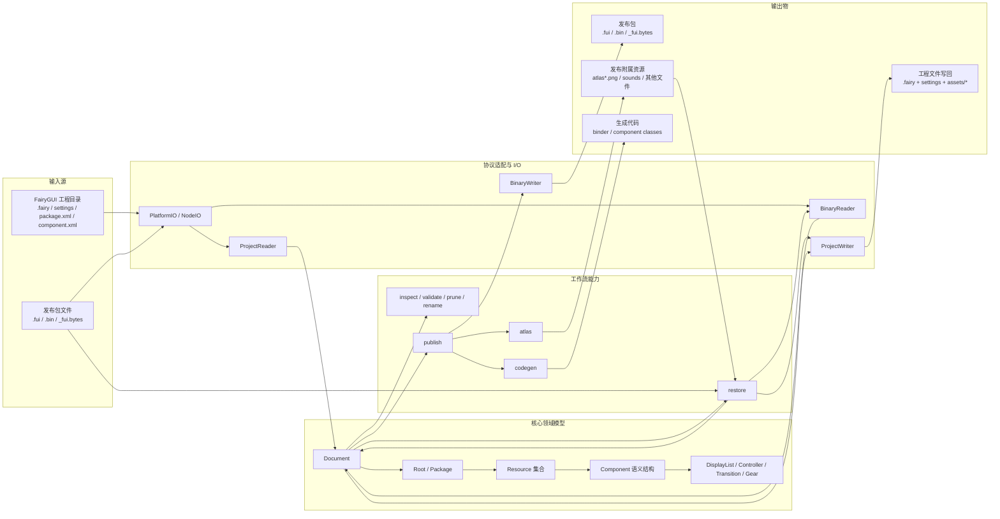
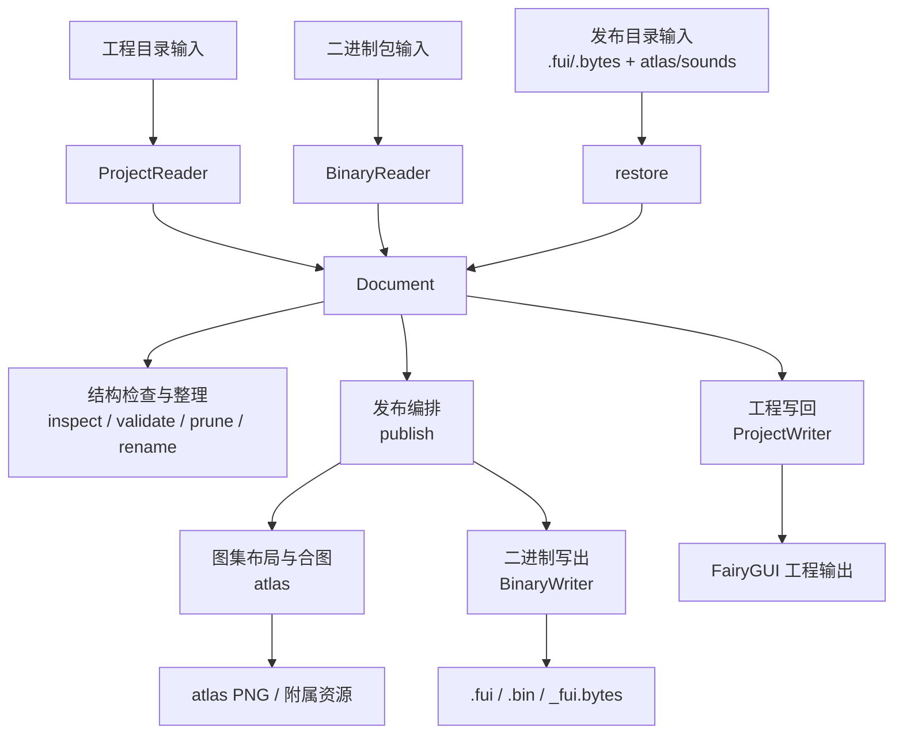

# OpenFairyGUI 架构图说明

## 结论

当前仓库更适合理解成五段式结构：`输入源 -> 协议适配 -> 领域模型 -> 工作流 -> 输出物`。  
其中真正稳定的中心层是 `Document + Property Graph`，CLI 和 publish 都只是围绕这层做编排。

## 关键细节

| 层级 | 当前职责 | 核心文件 |
|---|---|---|
| 入口层 | 命令行封装与参数分发 | `packages/cli/src/cli.ts` |
| 协议适配层 | 屏蔽平台文件系统差异，承接工程格式、二进制格式与工程 XML 协议元数据 | `packages/core/src/io/platform-io.ts`、`packages/core/src/io/node-io.ts`、`packages/core/src/io/project-xml-protocol.ts`、`packages/core/src/io/project-reader.ts`、`packages/core/src/io/binary-reader.ts`、`packages/core/src/io/component-decoder.ts` |
| 核心模型层 | `Document` 持有 `Property Graph`，统一组织项目节点、资源节点与组件语义对象 | `packages/core/src/document.ts`、`packages/core/src/properties/property.ts` |
| 项目骨架层 | `Root -> Package -> Resource -> Component` 组成基础结构 | `packages/core/src/properties/root.ts`、`packages/core/src/properties/package.ts`、`packages/core/src/properties/component.ts` |
| 工作流层 | 面向自动化的可组合处理管线 | `packages/functions/src/inspect.ts`、`packages/functions/src/validate.ts`、`packages/functions/src/prune.ts`、`packages/functions/src/rename.ts`、`packages/functions/src/publish.ts`、`packages/functions/src/restore.ts`、`packages/functions/src/codegen.ts` |
| 输出层 | 工程文件写回、图集产物生成、二进制封包输出与代码生成输出 | `packages/core/src/io/project-writer.ts`、`packages/functions/src/atlas.ts`、`packages/core/src/io/binary-writer.ts`、`packages/functions/src/codegen.ts` |

补充说明：
- `@openfairygui/core` 定义文档模型与协议读写能力。
- `BinaryReader` 仍然是二进制读入口；component block 的展开逻辑当前拆到内部 helper `component-decoder.ts`，对外调用面不变。
- `@openfairygui/functions` 只组合流程，不重新定义底层协议；当前 `publish` 与 `restore` 都在这里编排高层 workflow，并组合 `core` primitives。
- 当前 Unity、Layabox、Cocos Creator 共用同一条 `publish -> atlas / binary / codegen` 主链；差异主要体现在描述文件扩展名和代码生成 lane 选择，而不是工作流分叉。
- `@openfairygui/cli` 是入口层，不下沉协议细节。

## 当前工程 XML 协议元数据结构

`packages/core/src/io/project-xml-protocol.ts` 当前已经把工程 XML 协议拆成三层元数据：

| 层 | 作用 | 当前典型节点 |
|---|---|---|
| `attrs` | 描述节点自身允许的 XML 属性，统一 canonical 名与 aliases | `componentRoot.attrs`、`componentInstance.attrs`、`image.attrs`、`packageImageResource.attrs` |
| `children` | 描述稳定命名子节点集合，用于 `relation`、`gear*`、`action`、`item`、扩展子节点等结构 | `componentInstance.children`、`controller.children`、`transition.children`、`comboBoxExtension.children` |
| `containers` | 描述容器型结构，而不是普通 child map；当前用于表达有序多态的 `displayList` | `componentRoot.containers.displayList` |

当前三层结构的职责边界如下：

| 元数据层 | 当前 reader / writer 使用方式 | 当前限制 |
|---|---|---|
| `attrs` | `ProjectReader / ProjectWriter` 已作为属性读写的主依据 | 不表达结构条件 |
| `children` | 已参与稳定结构节点的读写与集合校验 | 目前是静态允许集合，不表达 `advanced=true`、`extention=...` 这类条件 |
| `containers` | 当前已参与 `displayList` 变体集合校验 | 只表达允许的 variant 集合，不负责顺序算法，也不表达 `text -> inputtext`、`list -> tree` 这类条件归一来源 |

`displayList` 当前在协议层的表达不是普通 `children.displayList`，而是容器元数据：

| 项目 | 当前实现 |
|---|---|
| 容器宿主 | `componentRoot` |
| 容器名 | `displayList` |
| 容器类型 | `orderedVariants` |
| 当前 variant 集合 | `image`、`graph`、`movieclip`、`jta`、`component`、`loader`、`loader3D`、`text`、`richtext`、`inputtext`、`group`、`list`、`tree` |

其中：

- `attrs` 和 `children` 已经进入 `ProjectReader / ProjectWriter` 的正式消费路径。
- `containers.displayList` 当前用于读写期的合法性校验，不直接替代现有 `displayList` 的顺序解析和序列化逻辑。
- 当前正式属性协议总表见 [Project XML 属性协议](./project-xml-attribute-reference.md)。
- `displayList` 的原始 XML tag、容器 variant 与 editor `DisplayListItem.type` 对齐口径，见 [Project XML DisplayList Tag 对齐](./project-xml-displaylist-variants.md)。

## 当前工程 XML 资源层覆盖

`ProjectReader / ProjectWriter` 当前对 `package.xml` 资源层的正式覆盖范围如下：

| 节点 | 当前正式读写属性 |
|---|---|
| `packageDescription` 骨架 | `id` |
| `branchDescription` 骨架 | 分支资源清单根节点 |
| `packageDescription > publish` | `name`、`path`、`branchPath`、`packageCount`、`genCode`、`codePath`，以及子节点 `atlas@name/index` |
| 通用资源节点 | `id`、`name`、`path`、`exported` |
| `image` 资源 | `atlas`、`scale`、`scale9grid`、`width`、`height`、`gridTile`、`qualityOption`、`duplicatePadding`、`smoothing` |
| `font` 资源 | `texture`、`renderMode`、`samplePointSize` |
| `misc` 资源 | 无附加属性；资源文件名由通用 `name` 承载 |
| `spine` 资源 | `width`、`height`、`require`、`atlasNames`、`anchor` |
| `dragonbones` 资源 | `width`、`height`、`require`、`atlasNames`、`anchor` |

其中 `image@atlas` 当前作为图片资源的纹理集模式字段读写，在正式模型中由 `ImageResource.textureSetMode` 承载。

## 当前分支工程目录口径

`ProjectReader / ProjectWriter` 当前已按编辑器目录结构处理资源分支：

| 目录 / 文件 | 当前口径 |
|---|---|
| `assets/<包名>/package.xml` | 主分支资源清单 |
| `assets_<branch>/<包名>/package_branch.xml` | 指定分支的资源清单 |
| `Root.branches` | 当前工程已发现的分支名列表 |
| 资源节点 `branch` | 分支资源通过正式资源字段区分，不再停留在临时 `extras` |

## 当前发布附属资源口径

`publish` 当前除二进制描述文件外，还会输出资源闭包内需要的附属文件。当前正式规则如下：

| 资源类型 | 当前发布行为 |
|---|---|
| `SoundResource` | 输出发布后的声音文件名 |
| `MiscResource` | 输出资源文件；若源文件扩展名为 `.atlas`，发布名改为 `.atlas.txt` |
| `SpineResource` | 输出 skeleton 主文件；若源文件扩展名为 `.skel`，发布名改为 `.skel.bytes` |
| `DragonBonesResource` | 输出 skeleton 主文件，当前保持原文件名 |
| `SpineResource` / `DragonBonesResource` 依赖 | 按 `require` 形成资源闭包，依赖的 `misc` / `image` 资源一并发布 |

## 当前分支发布口径

`publish` 当前已区分两种分支发布语义：

| 模式 | 当前实现 |
|---|---|
| `主干包含所有分支` | 保留包级 branch 表与主资源到分支资源的 item 映射，运行时可再切换分支 |
| `主干合并活跃分支` | 先在发布期选出主干与活跃分支合并后的资源集合，再进行 atlas 与二进制描述文件写出；分支资源复用主资源 id，二进制不再写 branch 表 |

当前 `publish` 在 `主干合并活跃分支` 模式下还会接受一个显式的活跃分支输入；未指定时视为发布主干。

## 当前发布产物还原口径

`restore` 当前作为 `functions` 层 workflow，面向发布目录，把发布二进制与同目录附属资源重建成一个可重读的 FairyGUI 工程目录。该链路不承诺还原原工程的编辑器设置或历史文件布局，只输出当前模型可表达的工程结构。

| 输入 / 资源 | 当前还原行为 |
|---|---|
| `*_fui.bytes` / `.fui` | 批量读取到同一个 `Document`，按 package id 合并依赖占位包与真实包 |
| `atlas*.png` | 由 `functions` 层 restore workflow 通过注入的图片裁切器按 sprite 映射裁切为碎图 PNG |
| `SoundResource` / `MiscResource` / `SpineResource` / `DragonBonesResource` | 优先按发布文件名从发布目录复制，回退按工程资源文件名复制；当发布文件基名等于资源 id 且资源名可用时，输出文件名回写为工程侧资源名；Unity 发布名 `.atlas.txt` / `.skel.bytes` 会还原为工程侧 `.atlas` / `.skel` |
| skeleton loose sidecar | 若发布目录存在 `.atlas.txt` / `.png` / `_tex.json` 等 sidecar，而二进制资源表未显式携带对应 `misc` / `image` 资源，restore workflow 会补建正式资源节点，并回填 `require` / `atlasNames`；当 `.skel.bytes` 资源能匹配到 Spine atlas sidecar 时，恢复结果按 `spine` 资源写回 |
| 工程设置 | 初始化 Unity 发布默认值，不从发布包反推原编辑器设置 |
| `packageDescription > publish` | 按发布包中的 atlas 页重建默认 publish atlas 条目，用于表达包级发布图集 |
| `SpineResource` / `DragonBonesResource` | 按同目录 `.atlas` / `.png` / `_tex.json` 资源推导 `require` 与 `atlasNames`；该推导只覆盖发布目录可见的依赖资源 |
| `MovieClipResource` / `FontResource` | 恢复 `.jta`、`.fnt`、`.ttf` 资源引用名；基于发布包中的帧、字形与 sprite 映射重建 `.jta` / `.fnt` 文件；位图字体派生 image resource 按当前样本规则恢复 editor 风格文件名与虚拟路径；SDF 字体按文件名补默认 `renderMode` / `samplePointSize` |

## 当前最关键的数据流

## 模块边界

| 模块 | 负责内容 | 不负责内容 |
|---|---|---|
| `@openfairygui/core` | 文档模型、属性节点、项目格式读写、二进制协议读写等底层能力 | 发布/还原策略、命令行参数封装 |
| `@openfairygui/functions` | inspect / validate / prune / rename / atlas / publish / restore 等流程组合 | 协议定义、Property Graph 基础建模 |
| `@openfairygui/cli` | 命令入口、参数解析、调用装配 | 领域模型定义、协议定义 |
| `@openfairygui/test-utils` | 测试辅助与夹具支持 | 生产协议与运行时流程 |
