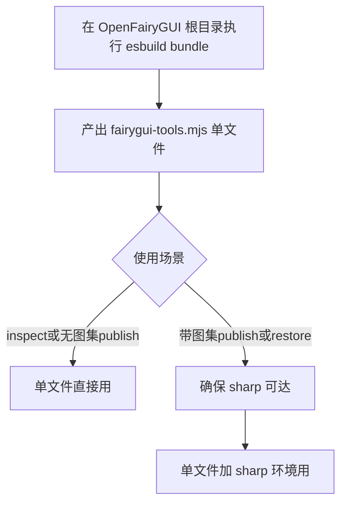

# fairygui-tools 单文件 bundle 方案分析

> 需求（最终版）：用 esbuild 把 OpenFairyGUI 库打包成单文件 `fairygui-tools.mjs`，
> 所有逻辑集成进去，用 `node fairygui-tools.mjs inspect ./UI` 即可运行。
> 本文含已实测的可行性验证。

## 一、方向演进与结论

需求经历三轮演化：

| 轮次 | 方向                 | 结论                         |
|------|---------------------|------------------------------|
| 一   | Python 包装 fairycli | 依赖 fairycli 全局安装，非独立 |
| 二   | Python 独立重写      | 需移植约 14000 行 TS，二进制逐字节兼容风险极高 |
| 三   | **esbuild bundle 单文件** | **已实测验证可行，推荐采用** |

第三轮方向是性价比最高的：不重写任何逻辑，直接用 esbuild 把 OpenFairyGUI 的 TS 源码 + 依赖打包成单个 `.mjs`，复用现成实现，产物天然与 FairyGUI 运行时二进制兼容（因为是同一套代码）。**零移植风险，零逐字节对齐风险。**

## 二、实测验证（可行性已证实）

本报告所有结论均经实跑验证，非纸面推断。

### 2.1 构建

环境：esbuild 0.28.2（项目内），Node v24.18.0。

```bash
npx esbuild packages/cli/src/cli.ts \
  --bundle --platform=node --format=esm \
  --external:sharp \
  --outfile=fairygui-tools.mjs
```

结果：

| 指标       | 实测值          |
|------------|----------------|
| 产物大小   | 902.1 KB       |
| 构建耗时   | 130 ms         |
| 入口       | packages/cli/src/cli.ts |
| external   | sharp          |
| 已打包进去 | core + functions + cli + pako + fast-xml-parser + property-graph |

### 2.2 运行验证（三条命令全通）

**--help**：

```bash
node fairygui-tools.mjs --help
# 输出完整 ofgui 帮助（含 inspect/publish/restore/list-fonts 四命令）
```

**inspect**（真实工程，30 个包）：

```bash
node fairygui-tools.mjs inspect packages/test-utils/test/fixtures/FairyGUI-unity/UIProject
# Project: ...FairyGUI-Unity-Examples.fairy
# ID: 5b85d3c8..., Type: 0, Version: 3.0
# Packages: 30, Images: 369, Components: 205, DisplayObjs: 870, ...
# 完整列出 30 个包明细
```

**publish --no-atlas**（二进制序列化，避开 sharp）：

```bash
node fairygui-tools.mjs publish .../UIProject --output ./pub-test --no-atlas --packages Basics
# Settings: ext=bytes, compressed=false
# publish: Written Basics_fui.bytes
# Done! 产出 Basics_fui.bytes
```

**publish 带图集**（sharp 从同目录 node_modules 加载）：

```bash
node fairygui-tools.mjs publish .../UIProject --output ./pub-atlas-test --packages Joystick
# Sharp loaded — atlas PNGs will be generated.
# atlas: Generated Basics_atlas0.png (1024x1024, 168 sprites)
# ...（所有包图集 PNG）
# publish: Written Joystick_fui.bytes
```

四项全过。inspect/publish/restore 的核心能力（XML 解析、引用分析、MaxRects 打包、二进制序列化、sharp 图集合成）在 bundle 后均正常工作。

## 三、sharp 的处理策略（关键设计点）

sharp 是原生模块（含 `.node` 预编译二进制），**无法**打进纯 JS 的 `.mjs`。实测确认的加载行为：

- bundle 时 `--external:sharp`，`.mjs` 内保留 `import('sharp')` 调用
- 运行时 Node 用 ESM 解析找 sharp，从**脚本文件所在目录**往上级找 `node_modules/sharp`
- 找到 → 图集 PNG 生成、restore 裁图可用
- 找不到 → CLI 降级（`publish.ts` 已有 try/catch），打印"Sharp not available"，inspect / `--no-atlas` publish 仍正常

由此得出分发形态：

| 使用场景                          | 需要的文件                          | sharp 要求        |
|----------------------------------|-------------------------------------|-------------------|
| inspect                           | 仅 `fairygui-tools.mjs`             | 不需要            |
| publish --no-atlas                | 仅 `fairygui-tools.mjs`             | 不需要            |
| publish 带图集 PNG                | `fairygui-tools.mjs` + sharp 可达   | 同目录 node_modules/sharp 或全局 |
| restore（含图集裁切）             | `fairygui-tools.mjs` + sharp 可达   | 同上              |

> 结论：**纯单文件分发可覆盖 inspect 和无图集 publish**；带图集/restore 场景需额外保证 sharp 可达。sharp 是 optional dependency，缺失不崩只降级。

## 四、构建配置详解

### 4.1 推荐构建命令

```bash
npx esbuild packages/cli/src/cli.ts \
  --bundle \
  --platform=node \
  --format=esm \
  --outfile=fairygui-tools.mjs \
  --external:sharp \
  --sourcesContent=false \
  --log-level=info
```

参数说明：

| 参数               | 作用                                        |
|-------------------|---------------------------------------------|
| `--bundle`        | 递归打包所有依赖成单文件                     |
| `--platform=node` | node 内置模块（fs/path/http）自动 external  |
| `--format=esm`    | 输出 ESM（.mjs），与项目 type:module 一致    |
| `--external:sharp`| sharp 不打包，运行时从 node_modules 加载     |
| `--sourcesContent=false` | 不内联源码内容，减小体积            |

### 4.2 workspace 包解析

项目是 pnpm workspace，`@openfairygui/core` 等通过 pnpm 的子包 `node_modules` 符号链接解析。esbuild 用 Node 模块解析，**能自动跟到** packages/core/src，无需额外 tsconfig paths 配置（实测从项目根 `npx esbuild` 直接成功）。

依赖打包情况：

| 依赖               | 类型     | 是否打包 | 备注                        |
|-------------------|----------|----------|-----------------------------|
| pako              | 纯 JS    | 是       | 二进制压缩 deflateRaw       |
| fast-xml-parser   | 纯 JS    | 是       | XML 解析                    |
| property-graph    | 纯 JS    | 是       | core 依赖                   |
| sharp             | 原生模块  | 否       | external，运行时加载        |
| node 内置模块     | 内置     | 否       | platform=node 自动 external |

### 4.3 tsconfig paths 不影响 bundle

tsconfig.json 的 `paths`（`@openfairygui/core` → `./packages/core/src/index.ts`）是 tsc 编译期映射，**esbuild 默认不读它**。实测确认 esbuild 靠 pnpm 的 node_modules 符号链接解析 workspace 包，无需 `--tsconfig` 或 alias 插件。

## 五、与 fairycli / ofgui 的关系

| 维度          | fairygui-tools.mjs（本方案）       | ofgui（OpenFairyGUI 自带）      | fairycli（已全局安装）        |
|--------------|-----------------------------------|--------------------------------|------------------------------|
| 形态          | 单文件 .mjs                       | 需 pnpm workspace + tsx 源码    | 全局 npm 包，链接固定目录     |
| 运行依赖      | 仅 Node（+ 可选 sharp）           | Node + pnpm + node_modules     | Node + 全局安装              |
| 命令          | inspect/publish/restore/list-fonts| 同左（4 命令）                  | 20+ 命令（含 AI 工作流）      |
| 可移植性      | 拷一个文件即可用                  | 需拷整个工程                   | 需 npm 全局安装              |
| 功能范围      | OpenFairyGUI 原生 4 命令           | 同左                           | OpenFairyGUI + AI 扩展        |

本方案定位：**OpenFairyGUI 原生能力的便携单文件发行版**。不含 fairycli 的 AI 工作流（generate/compose/repair/search 等），那些是 fairycli 独立项目的能力，不在 OpenFairyGUI 库内。

## 六、可能的问题

esbuild bundle 方案的问题远少于 Python 重写，但仍有一些需注意：

### 6.1 严重问题

| 编号 | 问题 | 影响 | 应对 |
|------|------|------|------|
| S1 | **sharp 分发依赖** | 带图集 publish / restore 在无 sharp 环境降级 | 文档说明；可选打包 sharp 的 .node + 运行时路径注入；或接受降级 |
| S2 | **单文件 902KB 偏大** | 首次 node 解析稍慢 | 可 `--minify` 压缩；902KB 对 Node 启动可接受 |
| S3 | **AI 工作流缺失** | fairycli 用户习惯的 generate/compose 等命令没有 | 本方案明确只覆盖 OpenFairyGUI 原生 4 命令；AI 工作流仍需 fairycli |

### 6.2 中等问题

| 编号 | 问题 | 影响 | 应对 |
|------|------|------|------|
| M1 | **ESM/CJS 互操作** | fast-xml-parser 是 CJS，bundle 进 ESM 需 esbuild 自动包装 | esbuild 自动处理（实测通过），无需干预 |
| M2 | **动态 import 路径** | cli 里 `await import('sharp')` 是动态的，esbuild 保留为运行时解析 | 故意保留 external，符合预期 |
| M3 | **node 版本要求** | ESM + top-level await 需 Node 14+（实测用 v24） | 文档声明 Node 18+ LTS 推荐 |
| M4 | **路径解析基准** | `import('sharp')` 从脚本目录而非 cwd 找 node_modules | 分发时把 .mjs 放在含 node_modules/sharp 的目录，或用 NODE_PATH |
| M5 | **--packages 过滤与 atlas 范围** | 实测发现 --packages Joystick 仍打包了所有包的图集 PNG | 这是 OpenFairyGUI 既有行为（atlas 遍历 root.listPackages()），非 bundle 问题；publish 只过滤最终 .fui 输出 |

### 6.3 轻微问题

| 编号 | 问题 | 影响 | 应对 |
|------|------|------|------|
| L1 | **版本固化** | bundle 时锁定了当时的 OpenFairyGUI 代码 | 重新跑构建命令即可刷新；可纳入 CI |
| L2 | **source map** | 报错栈无源码位置 | 可加 `--sourcemap` 辅助调试（增大体积） |
| L3 | **Windows 路径** | .mjs 跨平台路径处理 | Node 跨平台，实测 Windows 通过 |
| L4 | **list-fonts 命令** | ofgui 有，本方案也包含 | 实测在 bundle 内（--help 列出） |

## 七、分发形态建议

### 7.1 最小分发（inspect + 无图集 publish）

```
fairygui-tools.mjs   （单文件，902KB）
```

适用：快速检查工程、产出 .fui 二进制（不要图集 PNG）。

### 7.2 完整分发（带图集 + restore）

```
fairygui-tools.mjs
node_modules/sharp/   （或全局安装 sharp）
```

适用：完整发布（图集 PNG）、从发布产物恢复工程。

> sharp 可通过 `npm install sharp --no-save` 在目标目录装一份，或全局 `npm i -g sharp` + NODE_PATH。

## 八、落地步骤



1. 在项目根跑构建命令，产出 `fairygui-tools.mjs`
2. 把 `fairygui-tools.mjs` 拷到任意目录
3. `node fairygui-tools.mjs inspect ./UI` 即可
4. 带图集场景：同目录 `npm install sharp --no-save`
5. 可选：写个 `build.mjs` 脚本固化构建命令，纳入 package.json scripts

建议 package.json 增加脚本：

```json
"scripts": {
  "bundle": "esbuild packages/cli/src/cli.ts --bundle --platform=node --format=esm --external:sharp --outfile=fairygui-tools.mjs --sourcesContent=false"
}
```

## 九、结论

**esbuild bundle 单文件方案已实测可行，推荐采用。**

- 构建：902KB / 130ms，一条命令
- 运行：inspect / publish(--no-atlas) / publish(带图集) 三项实测全过
- 优势：零移植风险（复用 TS 实现）、二进制天然兼容运行时、便携单文件
- 代价：sharp 需运行时可达（仅图集/restore 场景）；不含 fairycli 的 AI 工作流

相比 Python 独立重写（14000 行移植 + 逐字节兼容高风险），本方案用 130ms 构建换来了同等能力，且输出与 FairyGUI 运行时天然一致。是当前需求下的最优解。

确认事项：是否就按本方案落地？是否需要把构建脚本固化进 package.json？是否需要单独写个 `build.mjs` + 使用说明 README？

---

## 引用说明

本文档基于实测验证 + 以下源码分析整理：
- `packages/cli/package.json` — ofgui 入口与 bin 定义
- `packages/cli/src/cli.ts` — bundle 入口，inspect/publish/restore 命令分发
- `packages/core/src/io/binary-writer.ts` — 二进制序列化（bundle 后实测正常）
- `packages/functions/src/publish.ts` — publish 编排，含 sharp 的 try/catch 降级逻辑（`publish.ts:511` 等）
- `packages/functions/src/atlas.ts` — 图集打包 + sharp 合成（bundle 后实测生成 PNG）
- `docs/fairygui-binary-package-format.md` — 二进制协议（bundle 后天然兼容）
- `tsconfig.json` / `pnpm-workspace.yaml` — workspace 结构（esbuild 靠 pnpm 符号链接解析）
- 实测命令记录：esbuild 构建 / node --help / inspect / publish --no-atlas / publish 带图集
