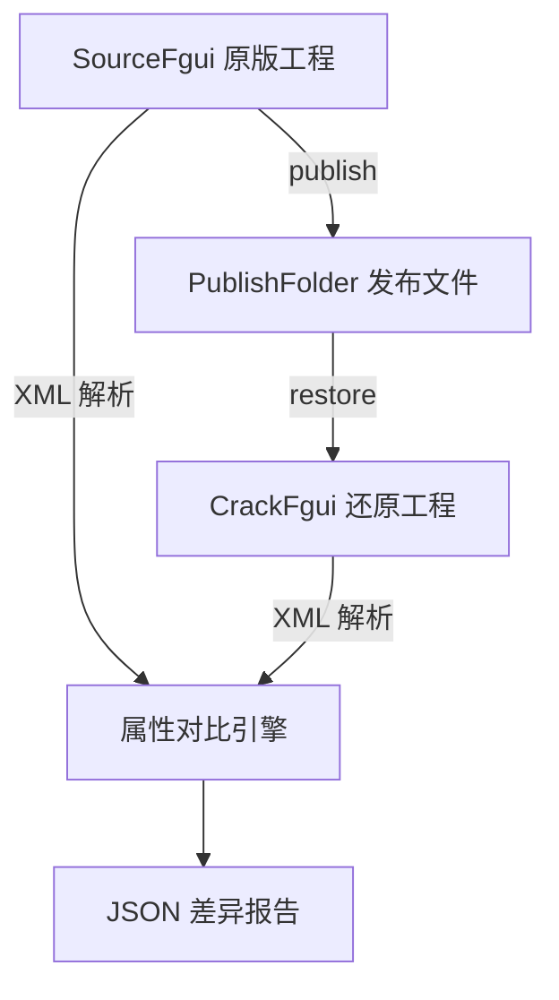

# 工程循环校验设计文档

## 概述

验证 OpenFairyGUI 的 restore（反编译还原）功能，确保 publish -> restore 循环后，还原的 FairyGUI 工程与原始工程的 XML 组件属性保持一致。

## 核心流程



三阶段流程:

1. **publish 阶段**: 调用 `publish()` 将 `TestProject/SourceFgui` 发布到 `TestProject/PublishFolder`
2. **restore 阶段**: 调用 `restore()` 将 `PublishFolder` 还原到 `TestProject/CrackFgui`
3. **对比阶段**: 遍历 SourceFgui 和 CrackFgui 中同名包的同名组件 XML, 递归对比每个元素的每个属性

## 测试文件

`packages/functions/test/roundtrip.test.ts`

使用项目现有 vitest 测试框架。

## JSON 差异报告格式

```json
{
  "summary": {
    "totalFiles": 120,
    "matchingFiles": 110,
    "diffFiles": 8,
    "missingFiles": 2
  },
  "diffs": [
    {
      "package": "Basics",
      "component": "Demo_Button",
      "path": "GButton[btn1].title",
      "expected": "Button",
      "actual": "",
      "type": "attribute_mismatch"
    }
  ],
  "missingInRestored": ["Basics/components/SomeComp.xml"],
  "extraInRestored": []
}
```

输出到 `TestProject/roundtrip-report.json`。

## XML 对比策略

### 按包匹配

遍历 `assets/` 下的子目录, 按 `package.xml` 中的包名匹配。

### 按组件匹配

同包下按文件名匹配 `.xml` 组件文件。

### 属性对比

对每个 XML 元素, 逐一对比所有属性。

### 属性规范化

restore 过程中有些属性会产生正常差异, 需要规范化处理:

| 差异类型 | 处理方式 |
|---------|---------|
| ID 重新生成 | 忽略 id 属性对比 |
| 浮点精度 | 数值属性容差比较, 如 0.9999 约等于 1.0 |
| 路径格式 | 统一 / 和 \, 去除尾部斜杠 |
| 属性顺序 | 不比较顺序 |
| 缺失属性 vs 默认值 | 源有 size=0 而还原文档没有该属性, 视为一致 |
| ui:// 引用中的包ID | 包 ID 可能改变, 但引用关系应保持一致 |

### 子元素对比

- 按 name 属性匹配同名子元素
- 无 name 时按元素顺序对比
- 递归对比子元素的属性和嵌套子元素

### 已知差异白名单

- `id` 属性（restore 后必定重新生成）
- `projectId`（全局 ID 变化）
- 包 ID 前缀在 `ui://` 引用中的变化

## 测试结构

```
describe('工程循环校验')
  |-- beforeAll: 清理目录
  |-- test('publish 阶段'): SourceFgui -> PublishFolder
  |-- test('restore 阶段'): PublishFolder -> CrackFgui
  +-- test('XML 属性对比'): 逐包逐组件对比, 输出 JSON 报告
```

### 断言策略

- publish/restore: 验证不抛错, 输出目录存在
- 对比: 统计差异, 输出 JSON 报告
- **测试不因差异而失败**, 重点是生成报告供人工审查

## 测试数据

使用现有 `TestProject/SourceFgui` 目录中的 FairyGUI-Unity-Examples 工程, 覆盖 Bag/Basics/Transition 等多个包。

## 依赖

- vitest: 项目现有测试框架
- fast-xml-parser 或 Node.js 内置 XML 解析
- sharp: 图片处理（已有）

## 类比理解

这个过程就像一个翻译的往返校验:

> 把一段中文翻译成英文（publish）, 再把英文翻译回中文（restore）, 然后对比两次中文是否一致。
> 有些差异是可以接受的, 比如名字变了（ID 重新生成）, 但语义应该保持一致（所有属性值要对得上）。

## 引用参考

- [FairyGUI 二进制包格式](../fairygui-binary-package-format.md)
- [项目 XML 属性参考](../project-xml-attribute-reference.md)
- [发布还原限制说明](../published-project-restore-limitations.md)
- [多图集还原注意事项](../多图集还原注意事项.md)
