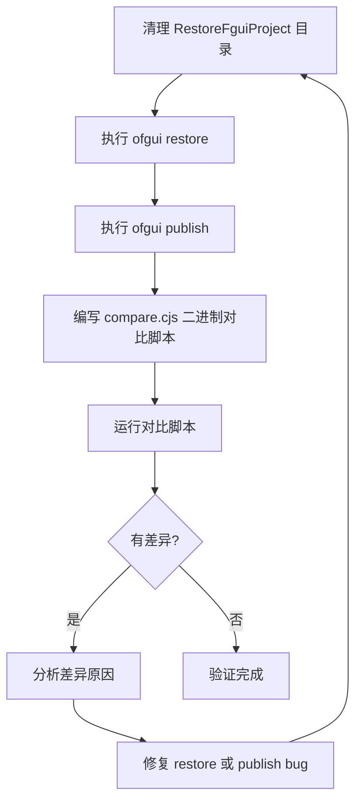

# FairyGUI 发布二进制对比设计方案

## 类比理解

想象你有一份精美的蛋糕配方(Source/UI_fui_Source.bytes)，你想确认你的烘焙师(restore+publish)能否完美复刻。流程是：

1. **读取配方** (restore) — 把配方翻译成你能理解的语言(FairyGUI 项目)
2. **重新写配方** (publish) — 用你理解的语言重新写出一份配方(发布的 .bytes)
3. **逐字对比** (compare) — 比较两份配方，找出哪些细节不对

## 1. 背景与目标

### 背景

OpenFairyGUI 项目提供了 FairyGUI 的还原(restore)和发布(publish)功能。还原是将 FairyGUI 编辑器发布的二进制文件(.bytes)还原为可编辑的项目结构，发布是将项目结构重新生成为二进制文件。

当前还原再发布后，生成的二进制文件与原始文件存在差异，需要：
1. 自动化地定位差异
2. 分析差异原因
3. 修复 restore 或 publish 逻辑中的 bug

### 目标

确保 `restore -> publish` 的 roundtrip 流程生成的二进制文件与原始文件尽可能一致。

## 2. 整体架构

```
Source/ (原始发布资源)
  UI_fui_Source.bytes  <- 原始二进制 (546KB)
  UI_atlas*.png        <- 图集
  *_多语言_*.txt        <- 多语言文件

Step 1: ofgui restore -> RestoreFguiProject/
  使用 Source 目录中的 .bytes + 图集 + 多语言文件还原

Step 2: ofgui publish -> PublishBytes/
  从还原的项目发布二进制定义文件（不发布图集）
  UI_fui.bytes <- 重新发布的二进制

Step 3: BinaryDiff 对比
  BinaryReader.parse(Source/UI_fui_Source.bytes) -> sourceData
  BinaryReader.parse(PublishBytes/UI_fui.bytes)  -> publishData
  逐字段对比 -> 差异报告
```

## 3. 对比脚本设计

### 文件位置

`TestProject/PublishBytesCompare/compare.cjs`

### 对比维度

| 层级 | 对比内容 | 预期差异来源 |
|------|---------|------------|
| Header | magic, version, compressed, packageId, packageName | restore 丢失版本号 |
| Block 0: Dependencies | dep count, each dep id/name | 包依赖序列化差异 |
| Block 1: Package Items | item count, 每个 item 的 type/id/name/path/file/exported/width/height + 类型特定字段 | 最大差异来源：组件编码/解码不一致 |
| Block 2: Sprites | sprite count, 每个 sprite 的 atlas/x/y/w/h/rotated/offset | sprite 坐标数据丢失 |
| Block 3: PixelHitTest | hit test count, pixel data | 命中测试数据丢失 |
| Block 4: String Table | string count, 每个字符串内容 | 字符串表顺序差异 |
| Block 5: Long Strings | long string count, 内容 | 长字符串处理差异 |

### 输出格式

```
=== FairyGUI Binary Diff Report ===

--- Header ---
  [MATCH] magic: 0x46475549
  [DIFF]  version: source=7, publish=6
  ...

--- Block 1: Package Items (source=142, publish=138) ---
  [DIFF] Item[3] component "抢先体验界面":
    component byte[45]: source=0x01, publish=0x00

--- Summary ---
  Total diffs: 23
  By block: Header=1, Items=15, Sprites=2, ...
```

### 实现策略

1. 先用字节级对比快速定位差异位置 - 找到第一个不同的字节偏移
2. 然后用 BinaryReader 解析，根据偏移定位到具体的 block/字段
3. 对于 component 内部数据（嵌套二进制），用 component-decoder 解析后逐字段对比

## 4. 实施步骤



### 步骤详情

1. **清理 RestoreFguiProject 目录** — 清空之前可能残留的文件
2. **执行 ofgui restore** — 从 Source 目录还原，包含多语言文件
3. **执行 ofgui publish** — 从还原项目发布到 PublishBytes（只关注 .bytes）
4. **编写 compare.cjs** — 二进制对比脚本
5. **运行对比脚本** — 输出差异报告
6. **分析差异** — 根据 diff 定位 bug
7. **修复 bug** — 修改 restore 或 publish 逻辑
8. **重新验证** — 重复步骤 1-5

## 5. 关键约束

- Source 中的多语言 txt 文件直接在根目录中，还原时需要 --lang-dir 指向 Source
- 图集 PNG 不参与对比，只对比 .bytes 二进制定义文件
- 对比脚本可重复运行，方便迭代修复
- 使用 CJS 格式以兼容项目配置

## 引用说明

- [FairyGUI 二进制格式分析](./packages/core/src/io/binary-writer.ts)
- [BinaryReader 解析逻辑](./packages/core/src/io/binary-reader.ts)
- [现有 XML 对比工具](./packages/functions/src/roundtrip-diff.ts)
- [CLI 命令参考](./packages/cli/src/cli.ts)
