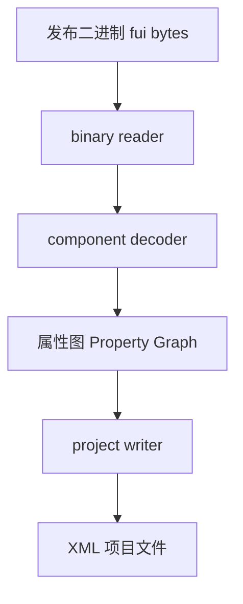

# Publish Binary Restore 注意事项

## 概述

从 FairyGUI 发布的二进制 (.fui.bytes) 还原为 XML 项目时，需要特别注意以下已知问题和解法。

---

## 已修复的问题

### 1. 子元素 size=0,0 丢失

**现象**：还原后 image/component 子元素的 `size` 属性变成 `0,0`。

**根因**：二进制格式中子元素 `hasSize=false` 时，FairyGUI 运行时使用源资源的自然尺寸。还原流程中没有补全这个尺寸。

**修复**：在 `binary-reader.ts` 的 `_hydrateChildSizesFromResources` 函数中，读取完所有包资源后，为 size=0,0 的 GImage/GMovieClip/GComponent 子元素从对应源资源继承宽高。

**涉及文件**：`packages/core/src/io/binary-reader.ts`

---

### 2. 子元素 pivot 丢失（影响 568 个子元素）

**现象**：还原后 GRichTextField、GTextField、GList、GGroup 等类型的子元素缺少 `pivot` 属性，导致组件位置偏移。

**根因**：`component-decoder.ts` 读取 pivot 时通过 `'setPivot' in child` 检查子元素是否支持 pivot。但以下 6 种类型没有实现 `setPivot` 方法：

| 类型 | 受影响数量 |
|------|-----------|
| GRichTextField | 276 |
| GTextField | 167 |
| GList | 66 |
| GGroup | 56 |
| GTextInput | 2 |
| GTree | 1 |

解码器从二进制中正确读取了 px/py/anchor 字节，但因为 `setPivot` 不存在而跳过了赋值，数据直接被丢弃。

**修复**：

1. **属性层**：为 GTextField（含 GRichTextField/GTextInput）、GGroup、GList（含 GTree）添加 `getPivotX()`、`getPivotY()`、`getPivotAsAnchor()`、`setPivot()` 方法
2. **协议层**：在 `project-xml-protocol.ts` 中为 text、group、list 的 attrs 添加 `pivot` 和 `anchor` 定义
3. **写入层**：在 `project-writer.ts` 中为 text 和 group 类型添加 pivot/anchor 写入逻辑
4. **读取层**：在 `project-reader.ts` 中为 text/richtext/inputtext 类型添加 pivot 读取逻辑

**涉及文件**：
- `packages/core/src/properties/g-text-field.ts`
- `packages/core/src/properties/g-group.ts`
- `packages/core/src/properties/g-list.ts`
- `packages/core/src/io/project-xml-protocol.ts`
- `packages/core/src/io/project-writer.ts`
- `packages/core/src/io/project-reader.ts`

**排查技巧**：在 `component-decoder.ts` 中临时添加 debug 日志，对比二进制中 `hasPivot` 布尔值与 API 返回的 pivot 值，可以快速定位是解码问题还是属性存储问题。

---

### 3. 之前已修复的其他问题

| # | 问题 | 根因 | 影响 |
|---|------|------|------|
| 1 | GGroup 子元素被过滤 | `getRuntimeChildren` 过滤掉非 advanced GGroup | 31个组件缺少约40个子元素 |
| 2 | MovieClip 名称多了 .jta 后缀 | 正则 `/.w+$/` 应为 `/\.\w+$/` | 3个 MovieClip 名称异常 |
| 3 | 文本内容尾部空格丢失 | `trimValues: true` 去除属性值尾部空格 | 文本尾部空格丢失 |
| 4 | 按钮音效数据丢失 | GButton sound 从 extras.sound 读取方式错误 | 按钮音效丢失 |
| 5 | 子元素 size 属性不写出 | project-writer 对部分类型不写 size | XML roundtrip 数据丢失 |

---

## 架构要点

### 数据流



### 关键检查点

1. **解码层**（component-decoder.ts）：检查所有属性是否都有对应的 setter 方法
2. **属性层**（properties/*.ts）：新增类型属性时，确保 getter 和 setter 都实现
3. **协议层**（project-xml-protocol.ts）：新增属性时，确保 XML 协议中有定义
4. **写入层**（project-writer.ts）：新增属性时，确保有写入逻辑
5. **读取层**（project-reader.ts）：新增属性时，确保有读取逻辑

### 添加新属性的完整检查清单

当需要支持一个新的子元素属性时，必须同时修改以下位置：

- [ ] `packages/core/src/properties/g-*.ts` - 添加 getter/setter
- [ ] `packages/core/src/io/component-decoder.ts` - 确认解码逻辑能正确赋值（检查 `'setXxx' in child`）
- [ ] `packages/core/src/io/component-encoder.ts` - 确认编码逻辑能正确读取
- [ ] `packages/core/src/io/project-xml-protocol.ts` - 添加 XML 属性定义
- [ ] `packages/core/src/io/project-writer.ts` - 添加 XML 写入逻辑
- [ ] `packages/core/src/io/project-reader.ts` - 添加 XML 读取逻辑

---

## 验证方法

### 统计对比

```bash
# 统计二进制中子元素 pivot 数量
node -e "
const { NodeIO, BinaryReader } = require('./packages/core/dist/index.cjs');
const reader = new BinaryReader(new NodeIO().createFileSystem());
reader.read(require('path').resolve('TestProject/PublishBytesCompare/Source/UI_fui.bytes')).then(doc => {
  let count = 0;
  for (const pkg of doc.getRoot().listPackages()) {
    for (const res of pkg.listResources()) {
      if (res.propertyType !== 'Component') continue;
      for (const child of res.listChildren()) {
        if ((child.getPivotX?.() ?? 0) !== 0 || (child.getPivotY?.() ?? 0) !== 0) count++;
      }
    }
  }
  console.log('Binary children with pivot:', count);
});
"

# 统计还原 XML 中 pivot 数量
grep -rn 'pivot=' RestoreFguiProject/assets/ | wc -l
```

### 精确对比

```bash
# 运行完整二进制对比
cd TestProject/PublishBytesCompare && node compare.cjs
```

---

## 引用

- [FairyGUI 二进制格式](https://www.fairygui.com/docs/guide/editor-publish)
- [FairyGUI 关系系统](https://www.fairygui.com/docs/guide/relation)
- [FairyGUI Pivot 和锚点](https://www.fairygui.com/docs/guide/display-list)
