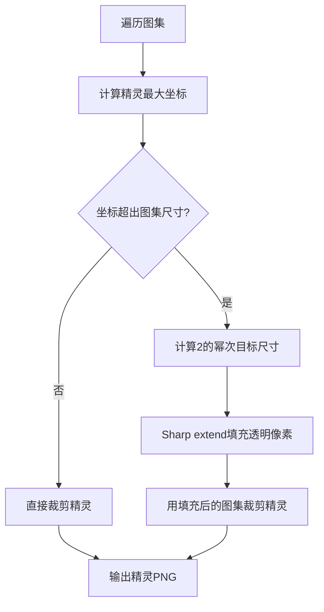

# FairyGUI 多图集还原注意事项

## 问题背景

从 Unity 发布的 FairyGUI 二进制包（`_fui.bytes` + 图集 PNG）还原工程时，图集图片可能被裁剪过，导致精灵裁剪坐标超出实际图集尺寸，还原失败或图片缺失。

## 问题一：多图集

一个 UI 包可以包含多个图集，FairyGUI 编辑器会根据资源数量和尺寸自动分页。

### 图集文件命名规则

| 命名格式 | 说明 |
|----------|------|
| `包名_atlas0.png` | 主图集（index 0） |
| `包名_atlas0_1.png` | 主图集分页 1（index 100） |
| `包名_atlas0_2.png` | 主图集分页 2（index 101） |
| `包名_atlas0_3.png` | 主图集分页 3（index 102） |
| `包名_atlas2.png` | 独立图集（index 2） |
| `包名_atlas9.png` | 独立图集（index 9） |
| `包名_atlas_xxx.png` | 自定义命名图集（index 0） |

### 实际案例

本项目 `UI` 包包含 8 个图集：

```
UI_atlas0.png       8192x4096   633 精灵
UI_atlas0_1.png     8192x8192   121 精灵
UI_atlas0_2.png     4096x4096    26 精灵  (被裁剪过)
UI_atlas0_3.png     2048x2048     7 精灵  (被裁剪过)
UI_atlas2.png       2048x1024     1 精灵  (被裁剪过)
UI_atlas9.png       1024x512     34 精灵
UI_atlas_8sjnpu.png 1024x512     30 精灵
UI_atlas_7bw6pf.png 2048x2048     7 精灵
```

### 还原时的处理

OpenFairyGUI 的 `restore.ts` 中 `_restoreAtlasImages` 会遍历 `pkg.listAtlases()` 返回的所有图集，逐个匹配对应的 PNG 文件。匹配逻辑在 `_sourceFileCandidates` 中生成候选文件名（`包名_文件名` 和 `文件名`），然后用 `_resolveSourceFile` 依次尝试。

**不需要额外处理**，代码已正确遍历所有图集。

## 问题二：图集尺寸被裁剪

### 现象

Unity 打包时会对图集 PNG 做优化，裁剪掉右侧和底部的透明像素区域。例如：

| 图集 | 原始尺寸 | 实际尺寸 | 说明 |
|------|----------|----------|------|
| atlas0_2.png | 8192x8192 | 4096x4096 | 裁掉一半 |
| atlas0_3.png | 8192x8192 | 2048x2048 | 裁掉四分之三 |
| atlas2.png | 4096x2048 | 2048x1024 | 裁掉四分之三 |

但二进制中记录的精灵坐标仍是基于原始尺寸的，例如某个精灵 `rect=(5802,4102 1920x1080)`，超出 4096x4096 的图集范围，Sharp 会报 `extract_area: bad extract area`。

### 判断方法

对比图集实际尺寸和精灵最大坐标：

```javascript
// 遍历图集所有精灵, 计算所需最小尺寸
let maxX = 0, maxY = 0;
for (const sprite of atlas.listSprites()) {
    const right = sprite.getRectX() + sprite.getRectWidth();
    const bottom = sprite.getRectY() + sprite.getRectHeight();
    if (right > maxX) maxX = right;
    if (bottom > maxY) maxY = bottom;
}
// 如果 maxX > 图集实际宽度 或 maxY > 图集实际高度, 说明被裁剪过
```

### 修复方案

在裁剪精灵前，先用 Sharp 将图集 pad 回原始尺寸：

```javascript
// 1. 检测图集是否被裁剪
const actualSize = await sharp(atlasPath).metadata();
if (actualSize.width < maxX || actualSize.height < maxY) {
    // 2. 向上取整到2的幂次
    const padW = Math.pow(2, Math.ceil(Math.log2(maxX)));
    const padH = Math.pow(2, Math.ceil(Math.log2(maxY)));

    // 3. 用透明像素填充到原始尺寸
    await sharp(atlasPath)
        .extend({
            top: 0, left: 0,
            right: padW - actualSize.width,
            bottom: padH - actualSize.height,
            background: { r: 0, g: 0, b: 0, alpha: 0 },
        })
        .png()
        .toFile(paddedPath);
}
// 4. 用 pad 后的图集进行精灵裁剪
```

### 当前代码中的实现位置

| 文件 | 位置 | 说明 |
|------|------|------|
| `packages/functions/src/restore.ts` | `_restoreAtlasImages` 方法 | 检测裁剪 + pad 逻辑 |
| `packages/functions/src/restore.ts` | `RestoreExecutionOptions` 接口 | `getImageSize` 和 `padImage` 声明 |
| `packages/cli/src/cli.ts` | `createRestoreImageProcessors` | Sharp 实现 `getImageSize` 和 `padImage` |

### 处理流程图



## 验证清单

还原完成后，检查以下几点：

1. 图集数量是否与实际 PNG 文件数一致
2. 输出的 PNG 数量是否等于所有图集精灵总数
3. 打开 `.fairy` 工程，检查是否还有图片缺失
4. 特别关注大尺寸图片（全屏背景、遮罩），它们最容易被裁剪
